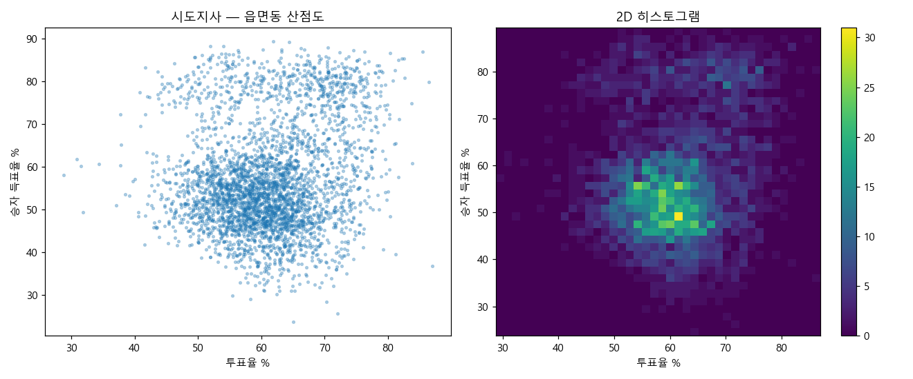

# 6·3 지방선거 개표 데이터, 통계로 따져봤습니다 — 공개 리포트

> **한 줄 결론.** 선관위가 공개한 전국 읍면동별 개표결과를 7개 선거·약 1,200개 선거단위에
> 걸쳐 5가지 통계 검정으로 훑었습니다. **"우연으로 설명 안 되는 조작의 흔적"은 나오지 않았습니다.**
> 일부 '경고(FLAG)'가 떴지만, 모두 *우연히 그 정도는 나오는 범위* 안이었습니다.
>
> ⚠️ 이 리포트는 부정선거를 "증명"하지도, "완전무결"을 보증하지도 않습니다. 떠도는 의혹을
> **누구나 재현할 수 있는 숫자**로 바꿔, "이게 진짜 이상한 일이냐"를 따져본 것입니다.
> **데이터와 코드를 전부 공개**하니 직접 돌려보세요.

---

## 1. 무엇을, 어떻게 했나

- **데이터**: 중앙선거관리위원회 선거통계시스템(info.nec.go.kr)의 *읍면동별 개표결과*.
  2026년 6·3 지방선거 7종(시도지사·교육감·구시군의장·시도의원·구시군의원·광역/기초 비례) 전국 전체.
  → 약 **35만 행**(`data/nec_2026_local.csv.gz`)으로 정리해 같이 공개합니다.
- **원칙**: 모든 검정은 *관측값*과 *우연히 그럴 기대치*를 **나란히** 냅니다.
  "수상하다" 같은 말 대신 **"관측 X, 기대 Y, 차이 Z배(σ)"** 로만 말합니다.
- **판정**: 각 단위마다 **PASS(정상 범위)** / **FLAG(들여다볼 가치 있음)** 만 찍습니다.

> **σ(시그마)가 뭔가요?** "우연 치고 얼마나 드문가"를 재는 자입니다. 0σ면 딱 평균,
> +3σ면 "우연이라면 1000번에 1~2번 있을까 말까"입니다. 보통 **+3σ를 넘으면** 한 번 들여다봅니다.

---

## 2. 검정별 결과 (비유로 풀어서)

### T1. "똑같은 표가 나왔다" — *생일 역설* 검사
**떠도는 의혹:** "A동과 B동에서 어떤 후보가 똑같이 444표! 이게 우연이냐?"

**비유 🎂:** 한 교실에 23명만 모여도 *생일이 같은 두 사람*이 있을 확률이 50%가 넘습니다.
"같은 게 있다"는 사실 자체는 사람이 직관으로 느끼는 것보다 **훨씬 자주** 일어납니다.
전국 수천 개 동네의 표를 짝지어 비교하면, 같은 숫자가 우연히 겹치는 건 오히려 *자연스럽습니다.*

**그래서 이렇게 검사합니다:** 실제로 겹친 쌍의 수를, *같은 데이터를 수천 번 무작위로 섞어 만든
"우연이라면 이만큼 나올 것"* 과 비교합니다. 관측이 기대보다 **유난히 많을 때만** 경고합니다.

| 선거 | 검사한 단위 | 결과 |
|---|---|---|
| 시도지사 | 17 | PASS 15 · **FLAG 2**(인천·전남) |
| 교육감 | 17 | PASS 17 |
| 구시군의장 | 222 | PASS 222 |
| 시도의원 | 412 | PASS 412 |
| 구시군의원 | 392 | PASS 392 |
| 광역비례 | 17 | PASS 16 · **FLAG 1**(충북) |
| 기초비례 | 168 | PASS 168 |

→ 약 **1,245개 중 3개**만 FLAG. 그런데 그 3개도 *겹친 쌍이 고작 1~3개*였습니다(아래 4장에서 설명).
**완전히 똑같은 줄(전 후보+합계 복제)은 단 한 건도 없었습니다.**

### T2. "사전투표와 본투표 차이가 너무 일정하다" — *자로 그은 직선* 검사
**떠도는 의혹:** "사전투표에서 특정 후보 몰표 비율이 동네마다 똑같다, 기계로 맞춘 듯하다."

**비유 📏:** 두 과목 시험에서 모든 학생이 정확히 *"수학 = 국어 + 10점"* 이면 누가 봐도 조작입니다.
정상이라면 점수는 **들쭉날쭉**합니다. 마찬가지로 사전·본 득표율의 관계가 *자로 그은 듯 완벽한
직선*이면 의심, **흩어져 있으면 정상**입니다.

**결과:** 7개 선거 **약 1,100개 단위 전부 PASS.** 완벽한 직선(R²>0.999) 사례 **0건.**
실제 데이터는 동네마다 충분히 흩어져 있었습니다 — 사람 손이 일괄로 맞춘 흔적이 없다는 뜻.

### T3. "투표율 높은 곳에서 몰표" — *혜성 꼬리* 검사 (러시아 부정선거 탐지법)
**비유 ☄️:** 투표함에 표를 채워 넣으면, *투표율이 비정상적으로 높은 동네일수록 특정 후보
득표율도 같이 치솟는* 모양이 생깁니다. 산점도로 그리면 오른쪽 위로 뻗는 **혜성 꼬리**가 보이죠.
조작이 없으면 그냥 가운데 뭉친 **둥근 구름**입니다.

**결과:** 7개 선거 **전부 PASS = 둥근 구름.** (그림은 `election_verify/out/T3_*.png`)
혜성 꼬리(고투표율 꼬리에서의 몰표)는 어디서도 나오지 않았습니다.



### T4. 끝자리·벤포드 검사 — *보조용, 약함* ⚠️
**비유 🎲:** 사람이 숫자를 지어내면 끝자리가 고르지 않게 나오는 경향이 있습니다.
하지만 **개표 득표수는 원래 이 검사에 잘 안 맞아서**(동네 크기가 제각각이라) *거의 항상 경고가
뜹니다.* 그래서 이 검사만으로는 아무것도 결론 낼 수 없습니다 — **단독 근거 금지, 참고용.**

---

## 3. FLAG 3건, 왜 "우연"인가

| 곳 | 무슨 일 | 숫자 | 해석 |
|---|---|---|---|
| **인천 시도지사** | 상위 2후보 표가 동시에 같은 동네 **쌍 1개** | 기대 0.02, 관측 1 (7σ) | 158개 동네를 짝지어 비교(약 1.2만 쌍)하면 1번쯤 겹침 |
| **전남 시도지사** | 같은 일 **쌍 3개** | 기대 0.4, 관측 3 (3.9σ) | 297개 동네(약 4.4만 쌍)에서 3번 |
| **충북 광역비례** | 같은 일 **쌍 1개** | 기대 0.09, 관측 1 (3σ) | 153개 동네에서 1번 |

**핵심 — '여러 번 보면 드문 일도 나온다'(다중비교).** 우리는 약 1,245개 선거를 동시에 검사했습니다.
"1000번에 1번" 같은 드문 일도 1,245번 시도하면 **평균 한두 번은 그냥 나옵니다.** 복권을 1,245장
사면 그중 한 장이 당첨되는 게 이상한 일이 아닌 것과 같습니다.

게다가 이 3건은 모두 *겹친 쌍이 1~3개*에 불과하고, **"한쪽 정당으로 쏠렸는가(방향성)"
검사에서도 정상**이었습니다. 조직적 조작이라면 한 곳이 아니라 *전국적으로, 한 방향으로*
나타나야 하는데 그런 패턴은 없었습니다.

---

## 4. 떠돌던 사례들에 대한 직접 답변

- **"송도1·2동, 박찬대 3030 = 유정복 1440 동일"**: 박찬대(국회의원)와 유정복(시장/도지사)은
  **서로 다른 선거**입니다. *무관한 두 숫자*가 한 동네에서 우연히 겹친 것으로, 통계적으로
  "놀랄 일"이 아닙니다(생일 역설). 같은 선거 안에서 본 T1에서도 인천은 1쌍뿐이었습니다.
- **"화순 이양면·강진 병영면, 민형배 둘 다 444"**: 민형배 후보는 **2024년 총선의 광양·곡성·구례
  선거구** 후보로, *화순·강진 투표지에는 애초에 등장하지 않습니다.* 서로 다른 선거구의 무관한
  숫자가 같은 값인 것 역시 생일 역설입니다. (그 선거를 직접 검증하려면 이 도구에
  `--election-id 0020240410` 로 2024 총선 데이터를 받아 돌리면 됩니다.)

> 떠도는 "동일 득표" 주장 상당수는 **서로 다른 선거/선거구의 무관한 숫자**를 비교한 것입니다.
> 그러나 의심을 품는 건 정당합니다 — 그래서 *직접 확인할 수 있게* 도구를 공개합니다.

---

## 5. 한계 (정직하게)

- **이 검사들로 잡을 수 있는 것**: 대규모·조직적·기계적인 조작의 통계적 흔적.
  **잡기 어려운 것**: 소수 표의 산발적 실수/조작은 통계로 안 드러날 수 있습니다.
- **T5·T6(투표지 부족 투표소 분석)**: "어디서 투표지가 부족했나" 공식 목록이 있어야 돌아갑니다.
  목록(`data/shortage_list.csv`)을 채우면 *"부족했던 곳이 특정 정당에 유리했나"*, *"단순히
  투표율이 높아서였나"* 를 검정합니다. (양식은 `data/shortage_list.example.csv`)
- **T4(끝자리/벤포드)는 약합니다.** 단독 근거로 쓰면 안 됩니다.
- **다중비교**: FLAG 개수 자체보다 *기대 대비 초과분*과 재현성을 봐야 합니다.

---

## 6. 직접 검증하는 법 (재현)

```bash
pip install -r requirements.txt
cd election_verify
python run_all.py            # 공개 데이터로 전체 요약 리포트 재생성
python run_all.py 시도지사    # 선거별
```
원본을 직접 받고 싶다면: `python nec_download.py --type all`
다른 선거(예: 2024 총선)도: `python nec_download.py --election-id 0020240410 --type 국회의원`

**데이터 출처**: 중앙선거관리위원회 선거통계시스템 https://info.nec.go.kr (공개 데이터)
**코드/데이터**: 이 저장소에 전부 포함 — 누구나 재현·반박 가능합니다.
